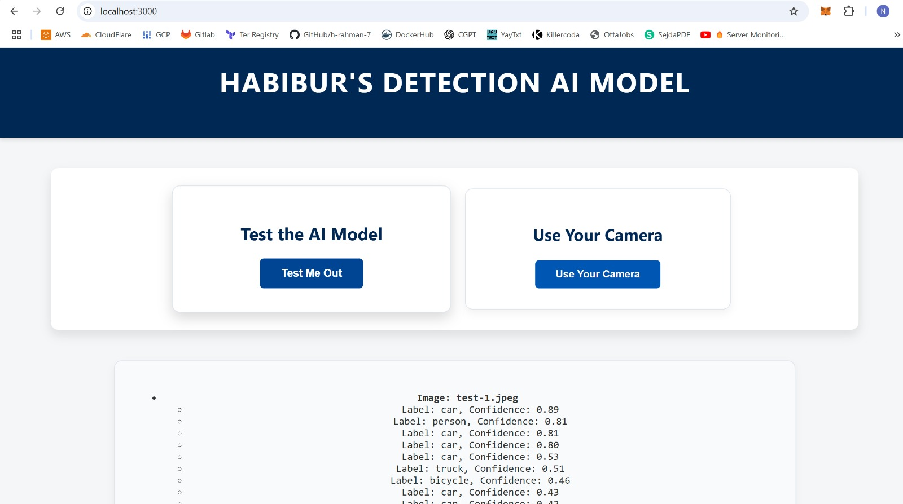

# Object Detection Web Application

## Introduction

This project is a web application that uses **YOLOv8** to detect objects in images. Users can upload an image, and the app identifies objects in it using AI. The app runs in a **Docker container** for consistency and ease of deployment. A **Helm chart** is included for deploying the app in a Kubernetes cluster.

---

## Application in Action

Below is an example of how the app works.

  

---

## Local Docker Setup

Follow these steps to run the app on your machine:

1. **Clone the Repository**  
   Open a terminal and run:  
   ```bash
   git clone https://github.com/h-rahman-7/ML-recognition.git
   cd app
   ```

2. **Build the Docker Image**  
   Create a Docker image for the app:  
   ```bash
   docker build -t object-detection-app .
   ```

3. **Add Your Images**  
   Add any images you want to test to the `images` folder in the `app` directory. For example:  
   ```bash
   cp /path/to/your/image.jpg ./images/
   ```

4. **Run the Docker Container**  
   Start the app using this command:  
   ```bash
   docker run -p 3000:3000 object-detection-app
   ```

5. **Access the App**  
   Open your browser and go to [http://localhost:3000](http://localhost:3000).

